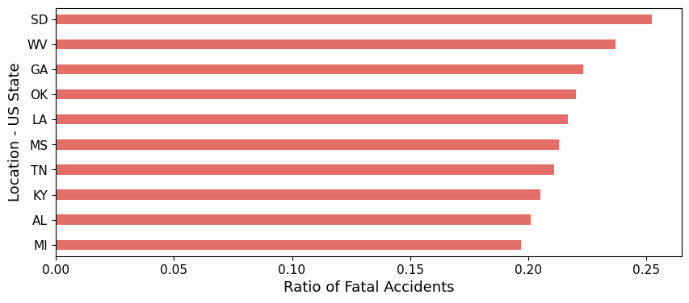
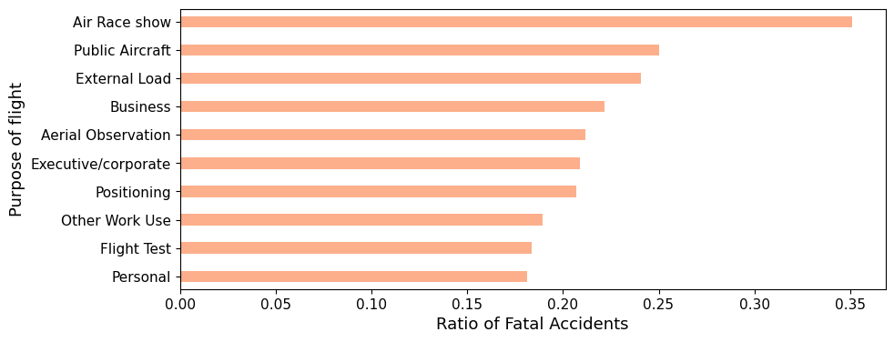
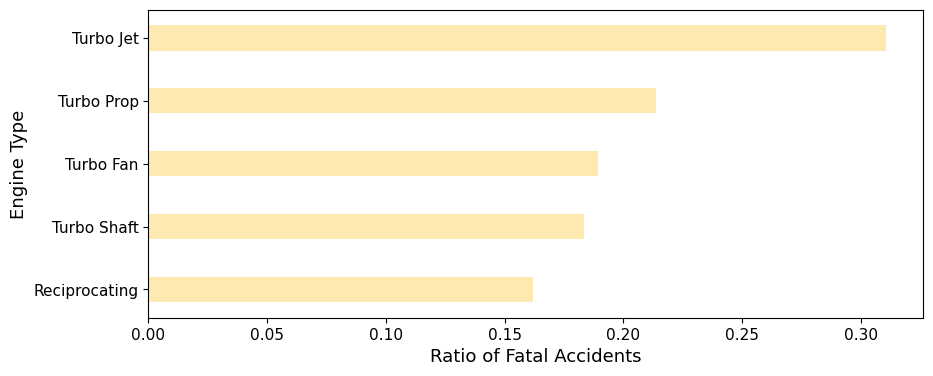
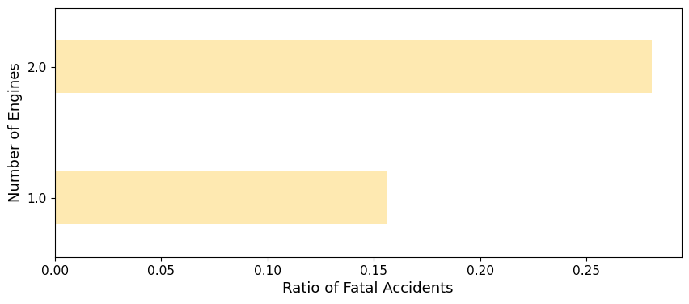
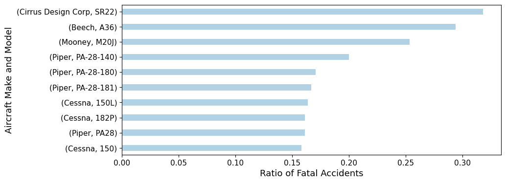
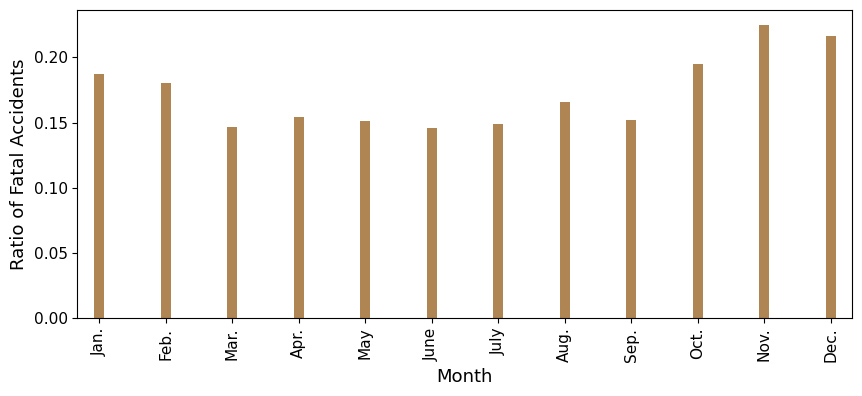

# Aviation Crash Data Analysis

    
## 1. Overview
A company is expanding to new industries in an attempt to diversify its portfolio. More specifically, they're interested in purchasing airplanes for commercial and private enterprises. This study focuses on using available aviation crash data to identify aircrafts with the lowest safety risk that the company could invest in for starting their business endevaour in this area. 

Initially, an overview of the project and the problem is given. Next, the data is explained and some of the main findings of the study will be summarized. Limitations and next steps are also explained in detail. More information on how the study is done and how you can navigate this repository effectively is included at the end. 

## 2. Business Understanding
### 2.1. Business Objective
This project analyzes the [aviation accident dataset](https://www.kaggle.com/datasets/khsamaha/aviation-accident-database-synopses) on Kaggle (Note that the actual data we're using is located [here](https://github.com/learn-co-curriculum/dsc-phase-1-project-v3/tree/master/data)). The findings will be used to make recommendations to stakeholders that may be looking to expand their business through purchasing and operating airplanes for commercial and private enterprises. 

### 2.2. Background Information
Before proceeding any further, we do some research to gain some domain knowledge. Different measures could be considered for assessing the safety of aircrafts. For example, the *number of fatal crashes per every 100,000 flights* seems like a standard measure to consider. The *number of non-fatal incidents that led to injuries* or required the pilot to take extreme measures for landing the aircraft may be considered as a secondary measure [REF](https://assets.performance.gov/APG/files/2023/june/FY2023_June_DOT_Progress_Aviation_Safety.pdf).

Some aspects of safety we can investigate are: 
- **aircraft make and model:** certain models may be more susciptible to incidents due to inherent manufacturing/design flaws.
- **number of engines:** a 4-engine aircraft should be safer compared to a 2-engine one
- **engine type:** Some engine types may be more susciptible to failures than others.  
- **location:** certain regions may have higher number of fatal aviation accidents. Factors like weather, terrain topography and the location being a hub for certain activities may contribute to these statistics. 

## 3. Data Understanding and Analysis

### 3.1 Source of Data
This project analyzes the [aviation accident dataset](https://www.kaggle.com/datasets/khsamaha/aviation-accident-database-synopses) on Kaggle (Note that the actual data we're using is located [here](https://github.com/learn-co-curriculum/dsc-phase-1-project-v3/tree/master/data)).

### 3.2. Description of Data
- The data has 31 columns. There are two data types: object (string/text) and float. Several of the categories that exist in the dataset will be relevant for our analysis. These include:  event date, location, country, injury severity, make, model, number of engines, engine type, total injuries and total and fatal/serious/minor injuries.
- As expected with any dataset, the data needs to be cleaned, in some cases reformatted and there are missing values in several rows that need to be handled.

### 3.3. Key Visualizations

<left>       

**Figure 1.** Ratio of fatal accidents in top 10 US states.  

<left>
            
**Figure 2.** Ratio of fatal accidents per purpose of flight. 

<left>
            
**Figure 3.** Ratio of fatal accidents per engine type and aircraft's total number of engines. 

<left>
            
**Figure 4.** Ratio of fatal accidents per number of engines. 

<left>
            
**Figure 5.** Ratio of fatal accidents per the make and model combination of aircrafts. 

<left>
            
**Figure 6.** Ratio of fatal accidents per month of the year.

## 4. Recommendations
Based on the analysis done above, the following **recommendations** for the stakeholders can be made: 
Based on the analysis done above, the following recommendations for the stakeholders can be made: 
1. It is recommended that the stakeholders do not pursue business in South Dakota, West Virginia, and Georgia since they rank first in terms of having the highest ratio for fatal aviation accidents.
2. It is recommended that business is not pursued in areas where aircrafts are usually used for *Air Race Shows*, as *Public Aircrafts* (used for government functions) and *External Load* aircrafts (aircrafts carrying loads that are suspended from the aircraft, often below the helicopter).  
3. It is recommended to be cautious about investing in aircrafts with single/dual engines and turbo jet engines since they're associated with a high ratio of fatal accidents.
4. It is recommended to avoid purchasing from the following manufacturers: Cirrus Design Corp, North American and Mooney since they're the top aircraft makes associated with the highest ratio of fatal accidents. More specifically, Cirrus Design Corp-SR22, Beech-A36 and Mooney-M20J with the worst performance.
5. It is recommended that the business puts contingency plans in place and increases regular inspection from late fall through the whole winter season. 

## Limitations and Next Steps
The above study is limited in the following ways:
1. The analysis is limited to the United States.
2. To avoid biasing the analysis when using a normalized metric, we only considered data entries with at least 50 accidents/incidents per any feature being analyzed. For any location, manufacturer, make and model with less than 50 counts of entries at hand, a more careful analysis is required. 
3. In the absence of information on the total number of flights (including those without accidents), we're relying on the ratio of fatal accidents to total flights with accidents as a metric for our analysis.

To improve the analysis, next steps include obtaining data on the total number of inbound/outbound flights to/from each state, the total number of flights per make and model as well as the total number of flights done per engine type and engine count in the aircrafts. This will enable us to use a more proper metric (normalized ratio of total number of accidents per total flights during a certain period of time). It may also be desirable to have data on the profitability of each business pursuit (for example, investing in aircrafts for recreational versus travel or instructional purposes). A category may seem to be associated with a high possibility of accidents. However, it may also be highly profitable such that the business wouldn't lose money overall. 

## Interested to know more?
- Please see the full analysis in this [Jupyter Notebook](https://github.com/setare92-ha/project-aviation-accident-data-analysis/blob/main/aviation_data_analysis.ipynb).
- For an interactive dashboard, please see this [Tableau dashboard](https://public.tableau.com/views/Aviation_Crash_Data_Analysis/Dashboard1?:language=en-US&publish=yes&:sid=&:display_count=n&:origin=viz_share_link)
- The presentation can be found [here](https://github.com/setare92-ha/project-aviation-accident-data-analysis/blob/main/presentation.pdf).

## How to navigate this repository

│   .gitignore  
│   aviation_data_analysis.ipynb  
│   README.md  
│   presentation.pdf  
│
├───figures  
│
├───images  
│
├───literature  
